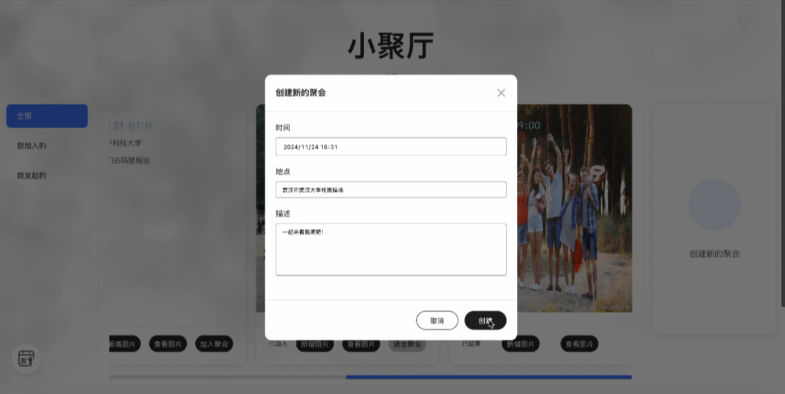
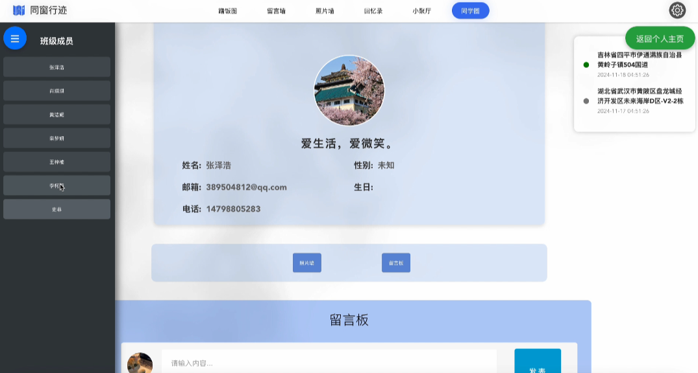

# ClassmateTrace

##

# Deployment

## Database

<aside>

  This project uses MySQL as its database.

</aside>

- The SQL source file is `dump-classmate_trace-202411181526.sql`. It is recommended to use MySQL version 8.0 or higher.

## Backend Project

<aside>

  The backend of this project is primarily built with C# and supplemented by a Java project. Both the C# and Java projects need to be started to run the project.

</aside>

- The backend project is located in the `classmate_trace/BACK` directory.
- The `csharp` folder contains the C# backend project, which is recommended to be run and debugged using Visual Studio.
- The `java` folder contains the Java backend project, which is recommended to be run and debugged using VSCode.

## Frontend Project

<aside>

  The frontend of this project is a Vue application.

</aside>

- The frontend project is located in the `classmate_trace/FRONT` directory.
- After downloading the frontend project, first extract the `web` and `node_modules` compressed files, then move the `node_modules` folder into the `web` folder. The `web` folder will then be the complete Vue frontend project. Please follow the Markdown instructions in the `web` folder for environment setup. It is recommended to use VSCode for running and debugging.

## Frontend and Backend Connection

<aside>

  This project adopts a frontend-backend separation model. The frontend, backend, and database can be deployed locally on the same machine or on separate machines. The connection methods for different deployment setups vary accordingly.

</aside>

### Local Deployment

- Start the `back_local` project in the `csharp` folder locally as the C# backend.
- Start the `serve` project in the `java` folder locally as the Java backend.
- Configure the database locally using the SQL source file.
- Update the database connection strings in the `back_local` and `serve` projects with the actual local database username, password, and database name.
- Start the `web` project locally as the Vue frontend.
- Update the API request URLs in the `web` project to use `localhost` for the IP address. Ensure the HTTP/HTTPS protocol and port match the startup configurations of the `back_local` and `serve` projects.
- If there are errors in parsing the API responses in the frontend project, it might be due to differences in the case sensitivity of the returned data fields between local and separate deployments. Adjust the casing of the problematic fields accordingly.

### Separate Deployment

- Start the `back_server` project in the `csharp` folder on Machine A as the C# backend. Configure the CORS gateway in the `Program.cs` file with the IP address of Machine B.
- Start the `serve` project in the `java` folder on Machine B as the Java backend.
- Configure the database on Machine A using the SQL source file. Create a `user` role on Machine A for Machine B and grant it sufficient permissions.
- Update the database connection strings in the `back_server` project with the actual database username, password, and database name on Machine A.
- Update the database connection strings in the `serve` project with the `user` credentials and the IP address of Machine A.
- Start the `web` project on Machine B as the Vue frontend.
- Update the API request URLs in the `web` project to use Machine A's IP address for the C# backend (using HTTP). The Java backend API request URLs can remain set to `localhost`.
- If there are errors in parsing the API responses in the frontend project, it might be due to differences in the case sensitivity of the returned data fields between local and separate deployments. Adjust the casing of the problematic fields accordingly.

## Additional Notes

### OSS Cloud Storage

<aside>

  When using OSS cloud storage in the frontend project, an Alibaba Cloud account is required. It is recommended to use your own cloud server account and ensure the firewall is properly configured.

</aside>

## Presentation

### Click on the map to change your location.

### Click to "circle yourself" to add this photo to your personal homepage.

### Uploaod meeting image(Albums are updated synchronously)

### Classmate Moments

### Administrator

